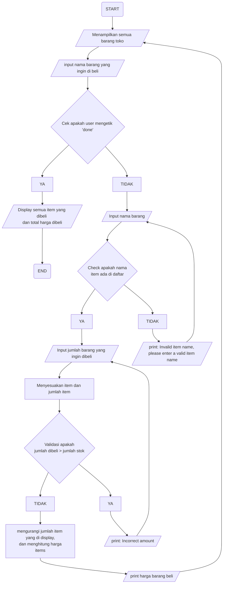

```mermaid
    flowchart TD;
    
    A(START) --> B[/Menampilkan semua barang toko/]
    B --> C[/input nama barang yang ingin di beli/]
    C --> D{Cek apakah user mengetik 'done'}
    D --> E[YA]
    E --> F[/Display semua item yang dibeli \ndan total harga dibeli/]
    D --> G[TIDAK]
    G --> H[/Input nama barang/]
    H --> I{Check apakah nama \n item ada di daftar}
    I --> J[YA]
    J --> L[/Input jumlah barang yang ingin dibeli/]
    L --> N[Menyesuakan item dan jumlah item]
    N --> O{Validasi apakah \n jumlah dibeli > jumlah stok}
    O --> P[TIDAK]
    P --> Q[mengurangi jumlah item yang di display,\n dan menghitung harga items]
    Q --> U[/print harga barang beli/]
    U --> B
    O --> R[YA] 
    R --> S[/print: Incorrect amount/]
    S --> L
    

    I --> K[TIDAK]
    K --> M[/print: Invalid item name, please enter a valid item name/]
    M --> H


    F --> z(END)


```
